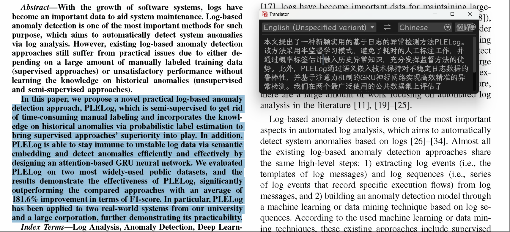

# Translator

Translator 是使用Rust编写的翻译小工具

## 特点

- 轻量
- 自动去除多余的换行和断句，优化PDF翻译体验
- 选中即翻译(划词翻译)，专注论文阅读

## 使用说明
1. 豆包
- 修改`/src/windows.doubao.rs`为`windows.rs`

- 打开 `/src/windows.rs`，修改为自己的豆包模型
```shell
    const MODEL: &str = "MODEL_NAME"; // 替换为你的模型名称
    const API_URL: &str = "https://ark.cn-beijing.volces.com/api/v3/chat/completions";// 替换为你的API URL
    ...
    let auth_header = format!("Bearer {}", "请替换为你的API key");
```
- 在终端`cargo build`

2. deepseek
- 修改`/src/windows.deepseek.rs`为`windows.rs`

- 打开 `/src/windows.rs`，修改为自己的deepseek API key
```shell
    let mut sync_llm = chat_completion_sync("your deepseek api key");
```
- 在终端`cargo build`

3. deepl
- 修改`/src/windows.deepl.rs`为`windows.rs`
- 打开 `/src/windows.rs`，修改为自己的deepl API key
```shell
    let api = DeepLApi::with("请替换为你的deepl API key").new();
```
- 在终端`cargo build`

- 工具位置在`/target/debug/translator.exe`。工具仅一个exe，启动后会驻留后台，选中文本后按 `alt+q` 唤起翻译界面，`esc`关闭界面，`ctrl+shift+d`完全退出

- 在界面开启的情况下，可以通过选中文本触发翻译行为，无需快捷键，俗称“划词翻译”



## Copyright

**Translator** © [zu1k](https://github.com/zu1k), Copyright reserved.
